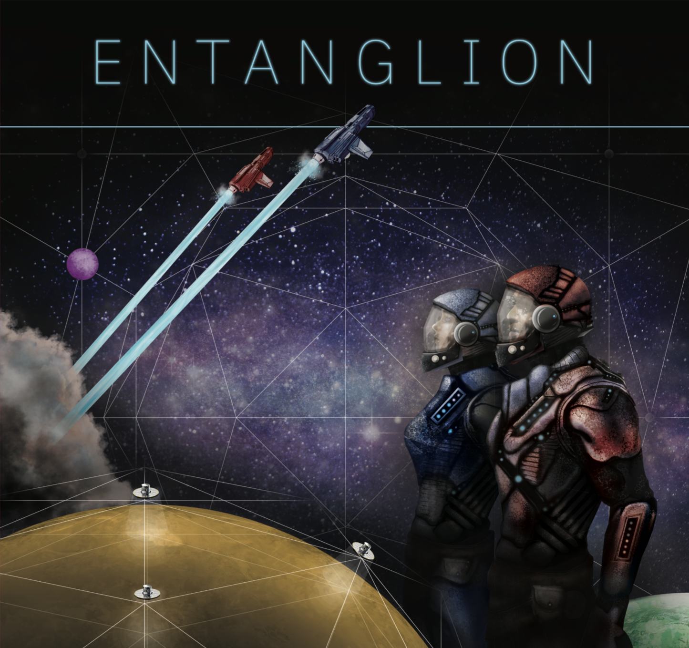

# Welcome to ENTANGLION
This is a browser based realization of the IBM board game Entanglion

1. [How is it played?](#howTo)
2. [ How we made it?](#howToM)
3. [ The frontend](#frontE)

## How to play the game

[The rulebook](https://github.com/Entanglion/entanglion/tree/master/game).

## How to make the game

We can print the board game and 3D print the gamepieces using [This link](https://github.com/Entanglion/entanglion/tree/master/assets).
Or we can make the game ourselves :D
This is the purpose of this github repository. Our goal is to make a virtual version of the entanglion game.

## Frontend Design
We use the Phaser JS game engine. Here's a useful tutorial:
https://www.youtube.com/watch?v=T9kOFSFvgKc .
You can also download the assets we used to make the games using [this download link](https://github.com/Entanglion/entanglion/releases) . 
